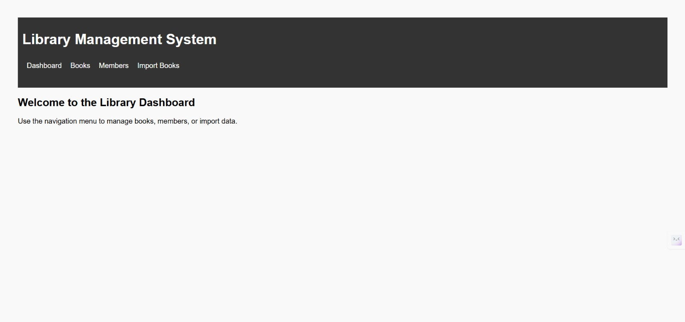

# Librady_management

# 📚 Library Management System (Django)

A simple web-based library management application built using **Python**, **Django**, and the **Frappe Book API**. This app allows librarians to manage books, members, and track book issue/returns.

---

## ✨ Features

- ✅ CRUD for Books and Members
- 🔍 Search books by title or author
- 🔄 Import books via [Frappe API](https://frappe.io/api/method/frappe-library)
- 📖 Issue and return books
- 💰 Rent fee on book return
- 🚫 Prevent issuing books if member debt > ₹500

---

## 📸 Screenshots

> _Add these after running your app locally and taking screenshots._

- **Dashboard**
- **Book List & Search**
- **Add / Import Books**
- **Issue/Return Workflow**
- **Member List**

---

## 🧰 Tech Stack

- Python 3.8+
- Django 4.2+
- SQLite (default)
- HTML/CSS (with custom styling)

---

## 🚀 Getting Started

### 1. Clone the repository

```bash
git clone https://github.com/yourusername/library-management.git
cd library-management




